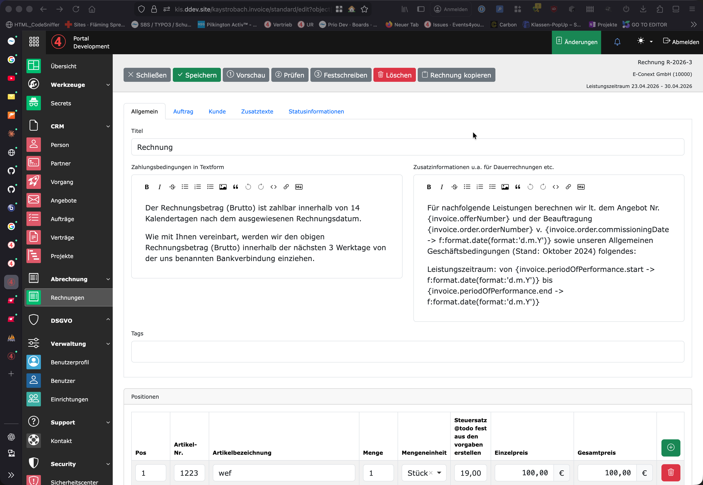
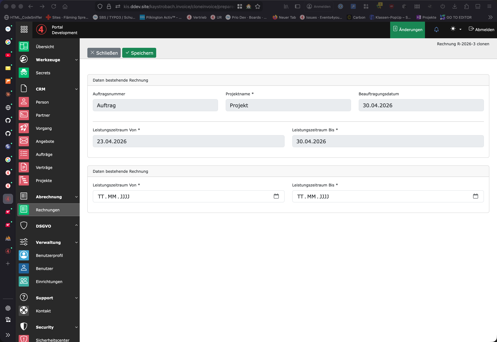
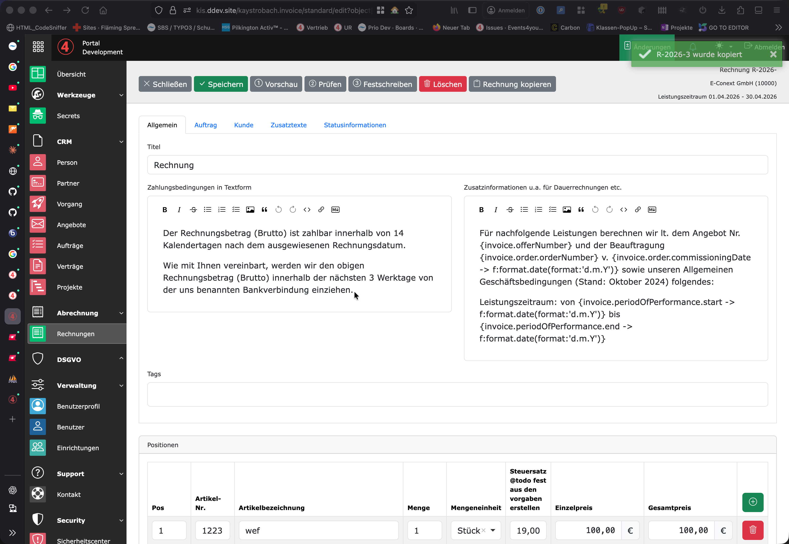

# Rechnung clonen

## Vorgehen

1. bestehende Rechnung oder Rechnungsentwurf öffnen
2. Button Rechnung kopieren klicken
    

3. Prüfen, ob die korrekte Rechnung kopiert werden soll
4. neuen Leistungszeitraum hinterlegen

    

3. Neue Rechnung wird durch speichern erstellt
4. Bestätigungsmeldung angezeigt
5. Normalen Prozess für Rechnungen durchführen

    

6. Rechnung Vorschau
7. Rechnung Festschreiben
8. Rechnung Versenden
